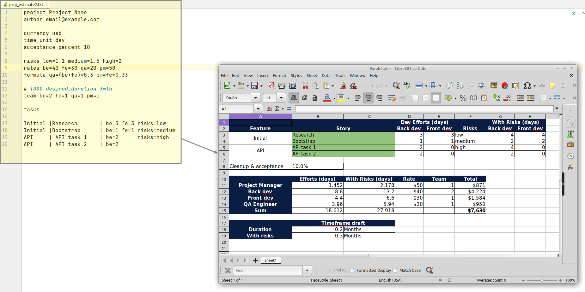

# estimatorium
Model to estimate software projects

## What is this?

This project is WiP. 

Currently, it's capable of converting the text description of a software project into Excel model to calculate project cost and duration according to tasks, rates and risks:

