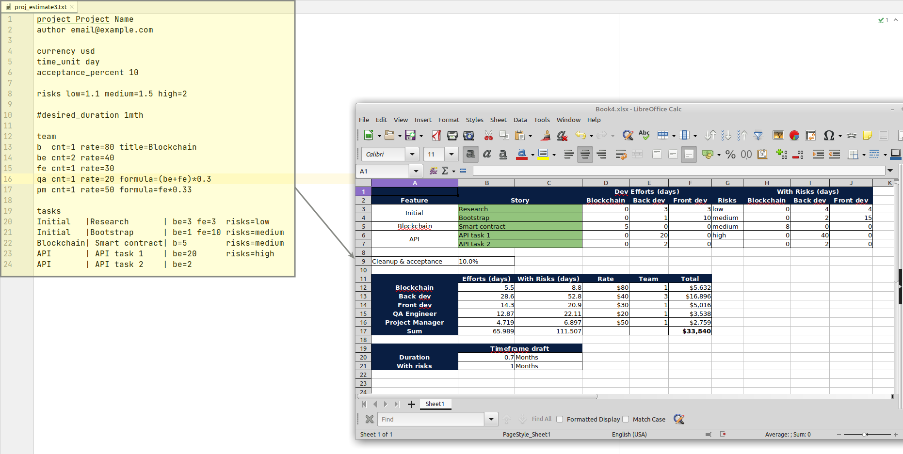

# estimatorium
[](https://github.com/xonixx/estimatorium/actions/workflows/tests.yml)

Model to estimate software projects

## What is this?

This project is capable of converting the text description of a software project into Excel model to calculate project cost and duration according to tasks, rates and risks:



## FAQ

### What is formula?

It's clear how to estimate tasks in terms of developer efforts (back, front, devops).

And the roles like QA / PM are easier to tie with an empirical formula to the dev efforts. Not on per-task basis.

It seems logical that, say, QA's amount of work should be proportional to devs work, since QA needs to test all the features they deliver.

## Usage

```
./estimator                      # no args = show help
./estimator -v/--version         # show version
./estimator -h/--help            # show help
./estimator proj.txt report.xls  # do the job 
```
